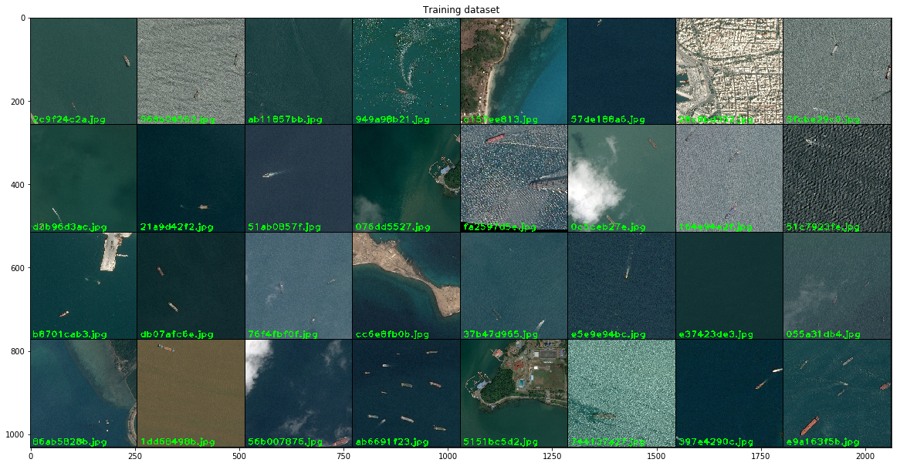

```{r packages, include=FALSE}
library(data.table) 
library(knitr)
library(plyr)
library(xaringan)
options(digits=10)

# Open the addin `Infinite Moon Reader`, then R will compile the Rmd file when click the save button. You do not need to click Knit to compile the Rmd file.

# For more instructions on r-markdown, please refer to [Yihui's recent slides](https://slides.yihui.org/2020-bearclub-rmarkdown.html).
```

```{python,include=FALSE}
#Python can be called in the Rmd file as follows: 
import sys
print(sys.version)
```

```{r,include=F}
# I am not sure about how to jump out from python engine
```

## To do list {-}

First we need to compare **the formats and shapes of segments** and understand how to transfer between different formats. We also need to compare different formats of images, such as CCD and SAR.

1. Download 4 images with ships from [the airbus chanllenge](https://www.kaggle.com/c/airbus-ship-detection). Extract the RLE of segments. Plot the images and the segments. (CCD images?)

2. Download 4 images from [`sarship` folder](https://www.jianguoyun.com/p/DbVLM8oQ3cTHBhiZx68D). Extract the segments. Plot the images and segments. (SAR images?)

3. Download 4 images from [the task 2, 3 of the challenge](http://sw.chreos.org/datasetlist). Extract the segments. Plot the images and segments. (CCD images for task 2 and SAR images for task 3).

4. Download 2 images from [`hou` folder](https://www.jianguoyun.com/p/DXdgvqgQ3cTHBhidx68D). Extract the segments. Plot the images and the segments. (CCD and SAR images?)

Second we need to study and compare different deep learning models in terms of [**their powers (classification, detection, semantic segmentation, instance segmentation)**](https://mp.weixin.qq.com/s/e2Zdrinw9RbVbpneYYIzxw), the calibration environment and requirements (such as tensorflow, keras, pytorch, detectron, etc), and the structure. I list several relevant deep learning models as follows:

- Detection 

  1. [Region Convolutional Neural Network (R-CNN)](https://github.com/yangxue0827/RCNN)

  2. [Spatial Pyramid Pooling Network (SPP-Net)](https://github.com/chengjunwen/spp_net)

  3. [Fast R-CNN](https://github.com/rbgirshick/fast-rcnn)

  4. [Faster R-CNN](https://github.com/shaoqingren/faster_rcnn)

- Semantic segmentation

  5. [Fully Convolutional Neural Network (FCNN)](https://github.com/MarvinTeichmann/tensorflow-fcn)

  6. [U-Net](https://github.com/jakeret/tf_unet)

  7. [V-Net](https://github.com/mattmacy/vnet.pytorch)

  8. U-Net + DNN

- Instance segmentation

  9. [Mask R-CNN](https://github.com/matterport/Mask_RCNN)


Third we discuss which model above is suitable for the following five problems:

1. [Airbus challenge](https://www.kaggle.com/c/airbus-ship-detection)

2. [AIR-SARShip](https://www.jianguoyun.com/p/DbVLM8oQ3cTHBhiZx68D)

4. [Task 2: single object detection of bridge](http://sw.chreos.org/competitionlist)

5. [Task 3: semantic/instance segmentation of 6 objects](http://sw.chreos.org/competitionlist)

3. ['hou' folder](https://www.jianguoyun.com/p/DXdgvqgQ3cTHBhidx68D)


# Goals {-}

By studying two examples, we aim to achieve the following four goals:

1. Study [the deep learning models](https://mp.weixin.qq.com/s/StibMN4buP8-mvzwXr56jg) for ship detection/segmentation and similar tasks of objects segmentation. 

2. Be familar with the important steps in image preprocessing, setting up a deep learning mdoel and calibrating the model in [a cloud computing server](http://cc.ruc.edu.cn/help/manual/login/).

3. Improve the predictive performance of deep learning models by tuning the hyper-parameters and modifying the model structure.

4. Attend [2020 Gaofen Challenge on Automated High-Resolution Earth Observation Image Interpretation](http://sw.chreos.org).

# [First example: Airbus ship detection challenge](https://www.kaggle.com/c/airbus-ship-detection/overview/description)
Shipping traffic is growing fast. More ships increase the chances of infractions at sea like environmentally devastating ship accidents, piracy, illegal fishing, drug trafficking, and illegal cargo movement. 

This has compelled many organizations, from environmental protection agencies to insurance companies and national government authorities, to have a closer watch over the open seas.

A lot of work has been done over the last 10 years to automatically extract objects from satellite images with significative results but no effective operational effects. Now Airbus is turning to Kagglers to increase the accuracy and speed of automatic ship detection.

## [Run-length encoding](https://www.kaggle.com/inversion/run-length-decoding-quick-start)
**Run-length encoding** is used to code the aligned bounding box segment around the ship.
The `train_ship_segmentations.csv` file provides **the ground truth** (true segment box) in run-length encoding format for the training images. 

## [Data visualization](https://www.kaggle.com/meaninglesslives/airbus-ship-detection-data-visualization)
We are required to locate ships in images, and put **an aligned bounding box segment** around the ships we locate. Many images do not contain ships, and those that do may contain multiple ships. Ships within and across images may differ in size (sometimes significantly) and be located in open sea, at docks, marinas, etc.

Note that object segments **cannot overlap**. There were a small percentage of images in both the train and test set that had slight overlap of object segments when ships were directly next to each other. Any segments overlaps were removed by setting them to background (i.e., non-ship) encoding. Therefore, some images have a ground truth which may be an aligned bounding box with some pixels removed from an edge of the segment. These small adjustments will have a minimal impact on scoring, since the scoring evaluates over increasing overlap thresholds.

We draw a sample of images in Figure \@ref(fig:images) and the same sample images with the ship segments in Figure \@ref(fig:ground-truth). 
```{r images, fig.cap='Images',echo=F}

```

```{r ground-truth, fig.cap='Images with ship segments',echo=F}
knitr::include_graphics('plots/1.png')
```

## Loss function: [$F_2$ score](https://www.kaggle.com/c/airbus-ship-detection/overview/evaluation) 
The predictive performance is evaluated on the **$F_2$ score** at different **intersection over union (IoU)** thresholds. The IoU of *a proposed set of object pixels* $A$ and *a set of true object pixels* $B$ is calculated as:
$$IoU(A,B)=\frac{A\cap B}{A\cup B}.$$
The metric sweeps over a range of IoU thresholds, at each point calculating an $F_2$ score. The threshold values $t$ range from 0.5 to 0.95 with a step size of 0.05: $t\in\mathcal{T}=\{0.5, 0.55, 0.6, 0.65, 0.7, 0.75, 0.8, 0.85, 0.9, 0.95\}$. In other words, at a threshold of 0.5, a predicted object is considered a "hit" if its intersection over union with a ground truth object is greater than 0.5.

At each threshold value $t$, the $F_2$ score value is calculated based on the number of true positives (TP), false negatives (FN), and false positives (FP) resulting from comparing the predicted object to all ground truth objects. The following equation is equivalent to $F_2$ score when $\beta$ is set to 2:
$$ F_\beta(t) = \frac{(1 + \beta^2) \cdot TP(t)}{(1 + \beta^2) \cdot TP(t) + \beta^2 \cdot FN(t) + FP(t)}.$$

- A true positive (TP) is counted when a single predicted object matches aground truth object with an IoU above the threshold.

- A false positive (FP) indicates a predicted object had no associated ground truth object.

- A false negative (FN) indicates a ground truth object had no associated predicted object. 

The average $F_2$ score of a single image is then calculated as the mean of the above $F_2$ score values at each IoU threshold:
$$\frac{1}{|\mathcal{T}|} \sum_{t\in\mathcal{T}} F_2(t).$$
Lastly, the score returned by the competition metric is the mean taken over the individual average $F_2$ scores of each image in the test dataset.

## [U-Net](https://www.kaggle.com/kmader/baseline-u-net-model-part-1)

There are several U-Net models and their deviations in [the Notebooks](https://www.kaggle.com/c/airbus-ship-detection/notebooks). It seems that the segments are always rectangles. The champion team name is "Rectangle is all you need". 

## [Mask R-CNN](https://zhuanlan.zhihu.com/p/48381892)

See [the general introduction](https://mp.weixin.qq.com/s?__biz=MzA5MjEyMTYwMg==&mid=2650242752&idx=1&sn=2bf846319d56abe741a53854fa3a4eb2&chksm=887221adbf05a8bbe8455adc875c2f2270cee78a6c814fcf717eb42d314f9ecb6c84a2440b72&scene=21#wechat_redirect) of R-CNN and Mask R-CNN.

# [Second example: AIR-SARShip-1.0: High-resolution SAR Ship Detection Dataset](http://radars.ie.ac.cn/article/doi/10.12000/JR19097?viewType=HTML)

## [Data](http://radars.ie.ac.cn/web/data/getData?dataType=SARDataset)

# [2020 Gaofen Challenge on Automated High-Resolution Earth Observation Image Interpretation](http://sw.chreos.org/competitionlist)

## Task 2: single object detection of bridge

## Task 3: semantic/instance segmentation of 6 objects

# Hou's project

## [Data](https://www.jianguoyun.com/p/DXdgvqgQ3cTHBhidx68D)

# Packages installation {-}

## pytorch {-}

## caffe {-}

## opencv {-}

## detectron2 {-}


